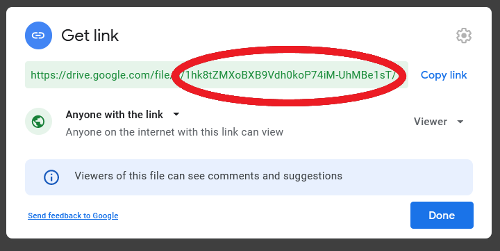
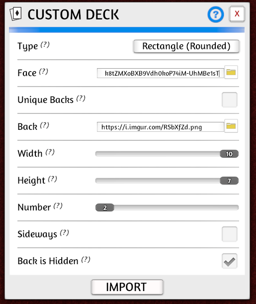
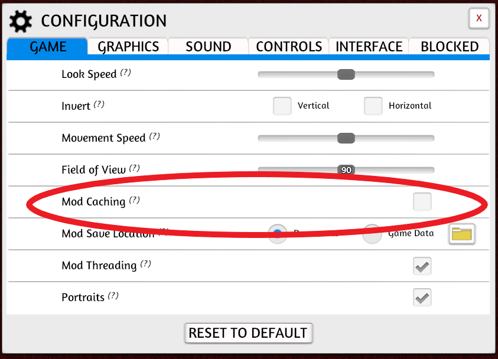

# Introduction

If you are interested in making a boardgame that involves cards (or a cardgame without a board at all), you've come to the right place!  Even if your game doesn't use standard-sized playing cards, it might have character sheets, player mats, or other significant components with ever-changing text. If you've already started making your game, you've probably found it can be frustrating to constantly update your cards as your game evolves.  There is a better way.

Of everything I have tried in my 4+ year journey of making a game, nothing has saved me more time than investing in card generation back by a shared online spreadsheet.  The generated cards are immediately available for online playtesting, which means I can update the game in less than a minute between playtests. Tools are great, but they should get out of the way and let you get back to working on your game.  For me, this setup has become nearly "invisible".  

The ultimate objective is to bring the next iteration of your game to playtesters as quickly as possible.  Successful games have dozens, perhaps hundreds, of iterations.  Invest some time now to reap the rewards later.

This article has two goals
1. Introduce the spreadsheet/programmatic card generation/online testing flow, along with rationale.
2. Provide a basic tutorial for getting set up.

Beyond prototyping and testing, there are lots of cool things you can do once you have this flow set up - but I'll save those for future posts.

# Rationale

Those who are already convinced can just skip ahead to the [instructions](#step-by-step-instructions).

## Why use a spreadsheet?

Putting your cards in a spreadsheet is an easy way to separate all of the raw numbers and game mechanics from the card's presentation.  Spreadsheets are a terrific way to answer some basic questions about your cards: which has the highest attack value; how many cards can be played for free; how many cards can I play on the first turn?  When it comes time to make a change, just use search-and-replace.

## Why generate cards programmatically?

If you are not a seasoned programmer, the idea of writing code to make cards from the data in your spreadsheet may seem daunting.  However, if you are bogged down by making tweaks to your prototype and already willing to make the investment to learn some sort of digital tool, you might as well learn a tool that will continue grow with you.  For your earliest prototypes, the "code" necessary to get started is minimal - just copy the examples and make a few tweaks.  I think [Squib](https://squib.rocks/), written in [Ruby](https://www.ruby-lang.org/en/) is a great tool for the job.

This is not to say that you can't do great work with a WYSIWYG editor.  Many real published games have been built with tools like [nanDECK](http://www.nandeck.com/), or no tools at all. I've tried these approaches and found that having the flexibiltiy, documentation, and power of a standard programming language saved me the most time.

There are some other benefits to using a prorgramming language to generate your cards.  Most major languages are cross-platform, so you can easily work on any operating system.  It is also very handy to have a code-based representation of your cards in case you want to mathematically analyze your game (see future posts!). You can write tests to verify behavior and check everything into soure control.  The ability to easily define different card generation modes is of surprising utility; you can generate cards for a printer, for the computer, with certain text removed, with color, etc.

## Why test virtually?

Locally we've been under some sort of lockdown for most of 2020, but, even before that, my co-designer and I were doing most of our testing remotely!  We live about 40 minutes apart, so having a digital prototype really lowers the barrier to playing a few games after work. The accumulation of all that weekly testing is the core of our design process.

We've found [Tabletop Simulator](https://store.steampowered.com/app/286160/Tabletop_Simulator/) to be more than adequate for our needs.  Though it is a litle difficult to get used to at first, Tabletop Simulator is incredibly flexible which is great for a game that is constantly changing.

During the last year, we've also moved our external playtesting online as well. Nothing beats playing in person, but there are distinct advantages when playing online: minimal setup, no cleanup, and so much less time spent assembling prototypes.  We use [Discord's](https://discord.com/) voice chat to replicate some of the in-person experience and gather feedback after testing.

We miss the convention scene, especially our local Protospiel, but I do believe all of this online testing will produce a high-quality game for the next time we play in person.

# Step-by-step instructions

To keep things brief, I will present only the tools that I currently use.  There are alternatives for each stage part of the implementation, but I have found these to work well for me over the last 4 years.  They are cheap (everything is free except for [Tabletop Simulator](https://store.steampowered.com/app/286160/Tabletop_Simulator/), which is $20 USD normally and $10 on sale), reliable, and robust.  However, if there are other tools you prefer to use, the same concepts should apply.

## Generating cards

I strongly recommend [squib](https://squib.rocks/) to generate your cards. The [documentation](https://squib.readthedocs.io/en/v0.16.0/) is fantastic, but I actually recommend that you starting by picking a [sample layout](https://github.com/andymeneely/squib/tree/v0.16.0/samples/layouts) that you like and work with that. I'll be working with the ["hand"](https://github.com/andymeneely/squib/blob/v0.16.0/samples/layouts/expected_layouts_builtin_hand_00.png) layout. At this stage, don't even worry about customizing the layout for your game; once you have something working from end-to-end, you can go back and tweak the code.

### Initial setup

If you don't already have tools you prefer for working with code, here are some free options for windows (I use these myself):
* [Visual Studio Code](https://code.visualstudio.com/)
* [Ruby](https://www.ruby-lang.org/en/documentation/installation/)

There are also a few commands that you will need to run in a terminal.  I'll assume `Command Prompt` since this is available on all Windows systems, but any terminal should work fine.  If you haven't used `Command Prompt` before, here's a [cheatsheet](http://www.cs.columbia.edu/~sedwards/classes/2015/1102-fall/Command%20Prompt%20Cheatsheet.pdf) to get you started.

Copy the [example code](https://github.com/miketoth/toth-games/tree/master/content/code-samples/generating-cards) into a new directory for your game. 

To install dependencies, run the following:

```
    gem install bundler
    bundle install
```

Run `bundle exec rake generate` to generate some cards.  You should see a png in the `_output` directory!

### Make it your own

The .csv file in `loc` holds the data that gets put into the cards. You can easily edit this file with a tool like Excel or [LibreOffice](https://www.libreoffice.org/download/download/). Modify the data and re-run `bundle exec rake generate` to generate new cards.  Change `mainfile.rb` to use your preferred template, and adjust the .csv accordingly.  Do note that Tabletop Simulator has a deck limit of 70 cards (so if you want more cards than that, make multiple decks).  Explore the options in Squib's [text method](https://squib.readthedocs.io/en/v0.16.0/text_feature.html); for example, you can try out some different fonts from [dafont.com](https://www.dafont.com/). Re-generate the cards often to make sure nothing is broken, and revert your changes if something is wrong.

The [resources](https://squib.readthedocs.io/en/v0.16.0/help.html) available for Squib in particular and [Ruby](https://www.ruby-lang.org/en/documentation/quickstart/) in general are quite comprehensive, so I won't attempt to replicate them here.  Spend as much time as you need on this step to generate a minimum playable version of your cards, but don't get caught up making your cards beautiful.  Remember, the goal is to get the next iteration of your game toplaytesters as soon as possible!

### Images

For an early game the excellent [game-icons.net](https://game-icons.net/) has all the images you need.  Spend a few minutes to find some useful iconography that will make it easier for your playtesters to understand your game.  Once you have these picked out, Andy Meneely's fantastic [Ruby library](https://github.com/andymeneely/game_icons) lets you easily pull these into the cards you've generated with Squib.

The example code has a few images already. These are defined in `mainfile.rb`.  Try changing these out with your own selections.

## Testing online  

### Make generated cards available for testing

First, you need to create client credentials to enable uploading.  Follow step one [in the People API Ruby Quickstart](https://developers.google.com/people/quickstart/ruby#step_1_turn_on_the). Save the resulting file as `credentials.json` in the root of your project.

For each deck you've generated, do each of the following steps.  This portion is a bit tedious, but only needs to be done once for each deck.

1. Use Google drive to upload your png (`warrior.png` in this example).
2. Enable link sharing so that anyone can view the file.  Copy the id (shown below).

3. Modify `cardgen.rb` to set the `uploadTarget` for your deck to the copied id.  In this case, the `uploadTarget` for the `warrior` deck is `1hk8tZMXoBXB9Vdh0koP74iM-UhMBe1sT` (you will need to replace this value in order to upload your own deck).
4. Optional: change your deck and run `bundle exec rake generate -- -o upload` to see the new deck uploaded!

### Import decks to Tabletop Simulator

[Tabletop simulator](https://store.steampowered.com/app/286160/Tabletop_Simulator/) is a flexible tool for defining and playing your game online.

First we need to point Tabletop Simulator at the save file where we will build the game.

1. Find the location of your Tabletop Simulator's save directory.  For example, my directory is `C:\Users\Brian\Documents\My Games\Tabletop Simulator\Saves\`.
2. Link `generated_tts_save.json` to the saves directory.  For example, on windows: `mklink C:\Users\Brian\Documents\"My Games"\"Tabletop Simulator"\Saves\generated_tts_save.json C:\Users\Brian\code\toth-games\content\code-samples\generating-cards\generated_tts_save.json` (note that you may need to enable [developer mode](https://docs.microsoft.com/en-us/windows/apps/get-started/enable-your-device-for-development) or run CMD as an administrator to do this).
3. Load the game in Tabletop Simulator!

Once you've loaded `generated_tts_save.json` in Tabletop Simulator, you can set up your game.  Do the following for each of your decks, and be sure to overwrite the save file once you are done:

1. Add a custom deck using `Objects -> Components -> Cards -> Custom Deck`.
2. Use the `uploadTarget` from above to populate the "Face" URL.  The full form of the URL is `https://drive.google.com/uc?export=download&id=<uploadTarget>`.  For example, I've filled in `https://drive.google.com/uc?export=download&id=1hk8tZMXoBXB9Vdh0koP74iM-UhMBe1sT` as the "Face" URL for the warrior deck in the image below.
2. Set `https://i.imgur.com/RSbXfZd.png` as the "Back" URL (you can also customize with your own image!).
2. Set "Number" to match the initial number of cards in the deck (`adjust_deck_size` will automatically correct the size when you upload cards in the future).
3. Make sure to check "Back is Hidden".
3. Click "Import".
4. Right click the deck and set the name to match your csv file (e.g. `warrior_deck`).  This is important so that `adjust_deck_size` can later adjust the size of the deck as you change the number of cards contained.



Now when you run `bundle exec rake generate -- -o upload` you should see the changes in Tabletop Simulator the next time you load `generated_tts_save.json`.  If you make changes and re-upload your files between games, you may need to return to the main menu and re-host in order to see the latest cards.  You can now host games to share your prototype with playtesters!  Make sure everyone has "Mod Caching" turned off (in `Menu -> Configuration`) so that they load the latest generated files for your game.



# Conclusion

Congratulations on making it all of the way through! It isn't easy to move your game development workflow online, but once you do, it is hard to imagine going back!  Please leave a comment if there is anything you can't get to work or any requests you have for future posts.
