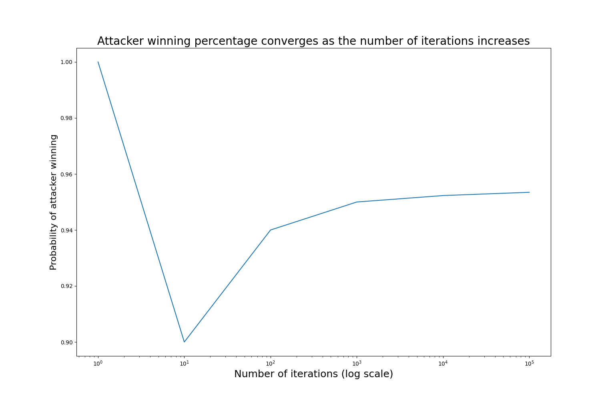
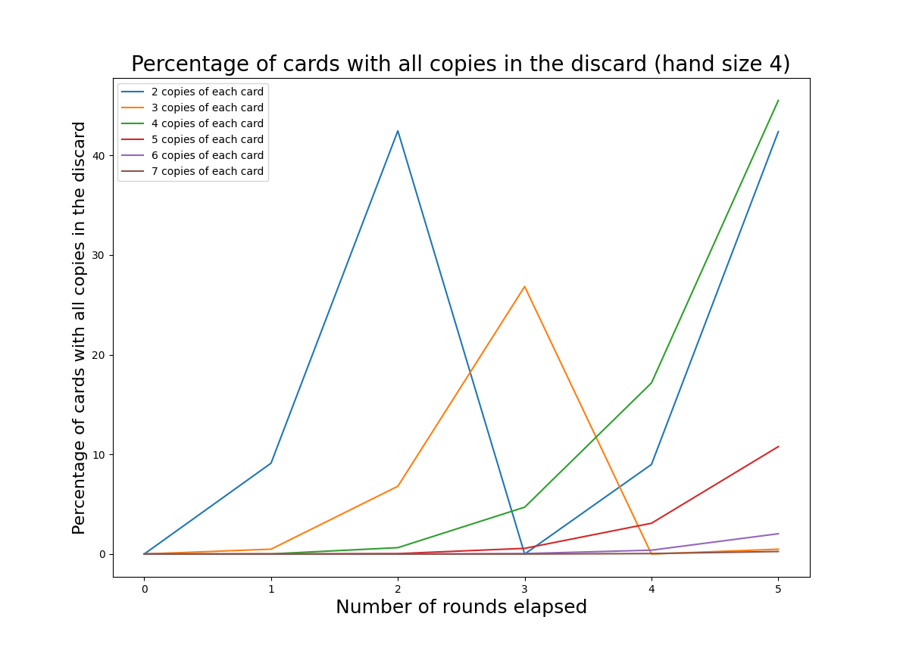
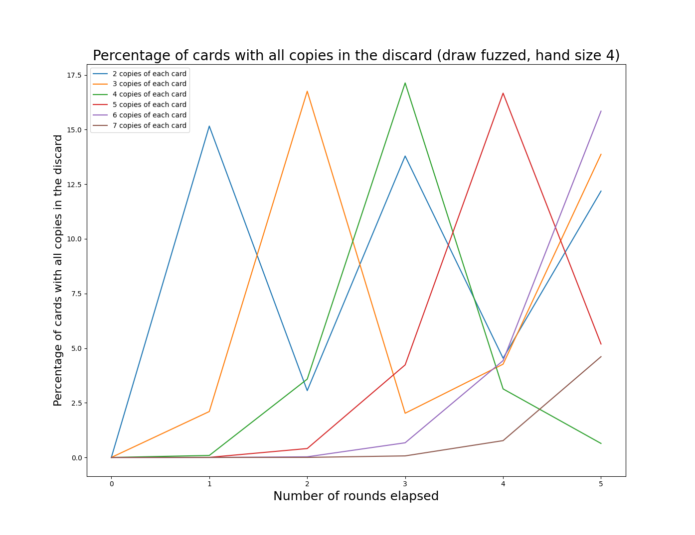
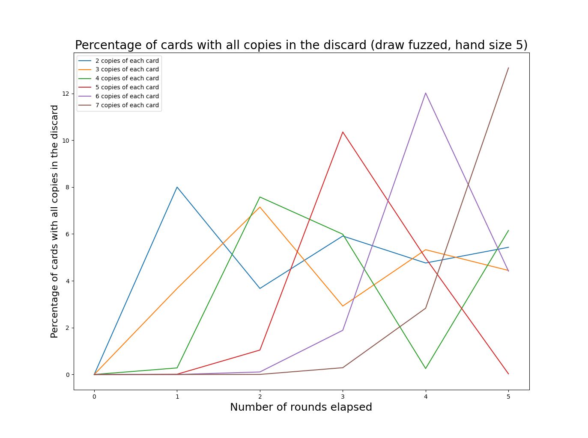
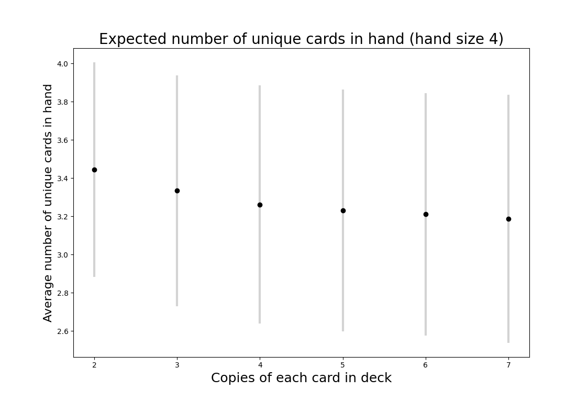
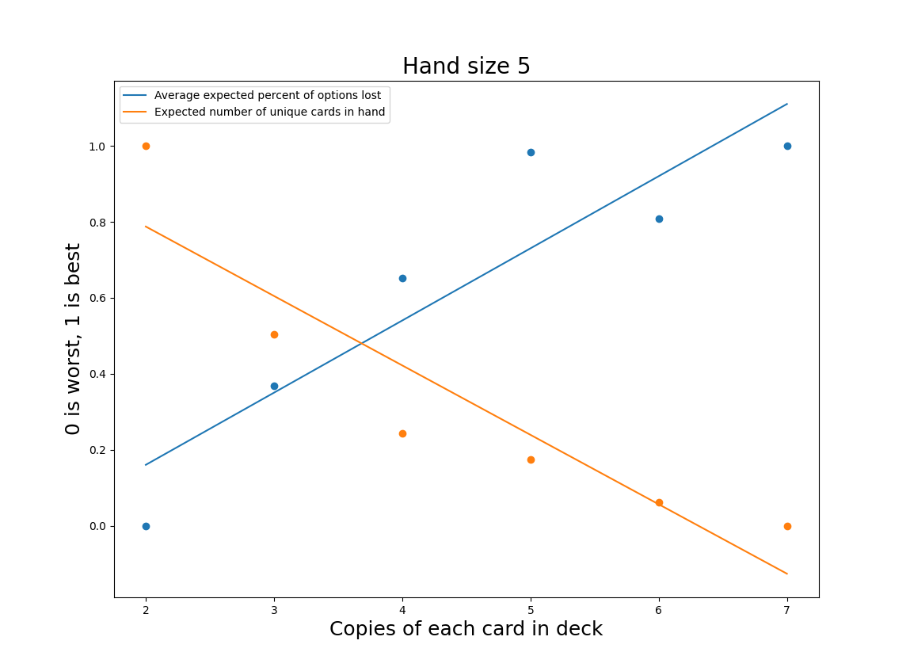
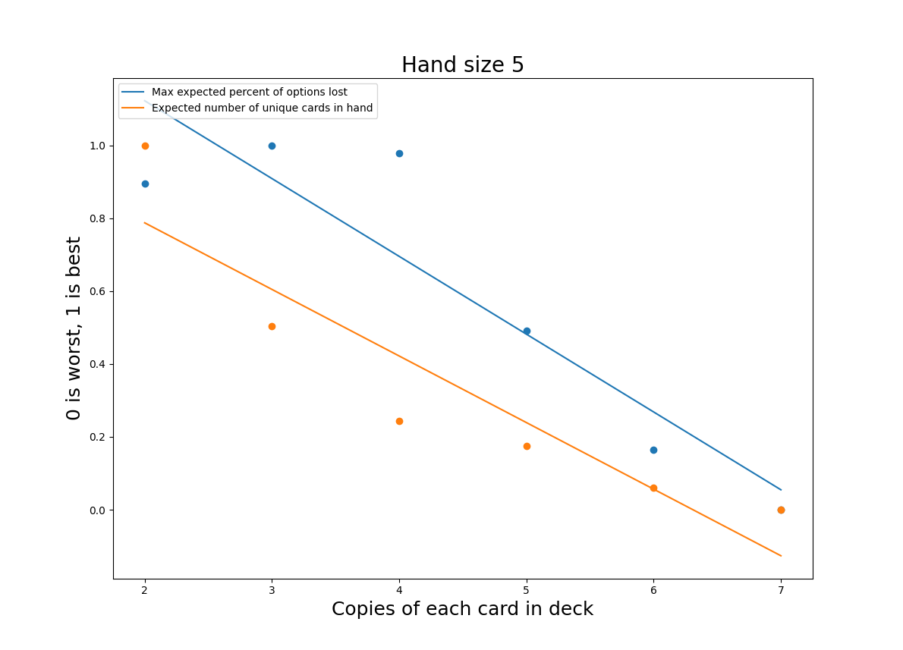

## Introduction

"Shouldn't I always attack with my whole army?"

"Why would I ever pick this card?"

If you've ever had a playtest that led to awkward questions like these - and realized that your players were totally right - you've probably wondered how you might catch this sort of issue during design.
Maybe you recalled a confusing formula like \\( {n\choose k} = \frac{n!}{k!(n-k)!} \\), but found it woefully inadequate when dealing with the sort of scenarios common in board games. 
What are the chances of drawing a specific set of cards in a particular order? What is the likelihood of rolling three sixes and two fives if you can reroll any number of dice three times?  How many units can you expect to have left after a Risk battle?

[Monte Carlo simulation](https://en.wikipedia.org/wiki/Monte_Carlo_method) is an incredibly simple tool for solving combinatorial problems, the likes of which frequently show up in board game design. Figure out the low-level math before you hit the table, and let your playtesters focus on finding the fun in your game.

## How it works

The intuition behind the Monte Carlo method is straightforward: if you aren't sure how likely something is, just measure it many times and take the average of your measurements.  If you can describe a scenario in code, you can run it thousands of times in order to converge on a solution.

## A Risk battle example

In [Risk](https://en.wikipedia.org/wiki/Risk_(game)), attackers may roll up to three dice and defenders may roll up to two.  The highest defense die is paired with the highest attack die, and the same is done with the second highest dice.  For each pair, the attacker loses a unit if the value of the defender's die is greater than or equal to the value of the attacker's die.  Otherwise, the defender loses a unit.  This system is simple enough to describe, but it is difficult to compute the expected outcome by hand.  Here's some [code](https://github.com/miketoth/toth-games/tree/master/content/code-samples/monte-carlo/risk.py) that describes the combat system:

```python
def rollADie():
  return random.randint(1,6)

def fightToTheEnd(attackingPieces, defendingPieces): 
  while attackingPieces > 0 and defendingPieces > 0:
    attacks = sorted([rollADie() for i in range(min(attackingPieces, 3))], reverse=True)
    defenses = sorted([rollADie() for i in range(min(defendingPieces, 2))], reverse=True)

    i = 0
    while i < len(attacks) and i < len(defenses):
      if (attacks[i] > defenses[i]):
        defendingPieces -= 1
      else:
        attackingPieces -= 1
      i += 1

  return (attackingPieces, defendingPieces)
```

This code assumes that the attacker continues attacking until the defender is defeated or the attacker has no units left with which to attack. For this example, the attacker has 30 units and the defender has 20.

When we run this code many times, we can extract some probabilities:

```python
output = []
for i in range(10000):
  output.append(fightToTheEnd(30, 20))

print("Expected number of attacker remaining: " + str(statistics.mean([x[0] for x in output])))
print("Expected number of defender pieces remaining: " + str(statistics.mean([x[1] for x in output])))

print("Probability of the attacker winning: " + str(len([x for x in output if x[0] > 0])/len(output)))

```

This gives us three values:

1. Expected number of attacker units remaining: 13.2596.
2. Expected number of defender units remaining: 0.1676
3. Probability of the attacker winning: 0.9544 (95%)

 I found this quite surprising!  If you are playing Risk against only one opponent, you should always be attacking as long as you can attack with at least 3 units. In this example, the attacker ends with 13 units on average, whereas the defender has effectively zero (the average number of defender units remaining is greater than zero because of the very unlikely - but still possible - event that the defender wins).  So the expected case is that the defender loses 20 units, but the attacker only loses 17.  That adds up over the course of a long game; all things being equal, you'd rather be attacking!

If you run this yourself, you will likely get slightly different numbers.  Thats because the Monte Carlo method is an approximation - we approach the true value as we increase the number of iterations, but we will never reach it.  That being said, we can get quite serviceable results from a relatively small number of iterations.



With only a single iteration, the result is either 0 or 1 - not very interesting.  The probability becomes stable once we have reached about 10,000 iterations; I'll be using 10,000 iterations for the following example.

## A Legends of the Arena deck size example

In our game [Legends of the Arena](../../games/loa) each player has a deck that is reshuffled when exhausted. Similar to rolling dice in the Risk example above, the randomness of drawing cards is well modeled by Monte Carlo simulation. Players discard their hands and draw four new cards at the end of each turn.  Additionally, players draw a card after being attacked, and certain cards can allow you to draw more (these effects will need to be modeled!).  Decks have three copies of each card, and most decks have 6 different cards (I'll be assuming 6 different cards for this analysis).

Because our cards tend to counter each other in a rock-paper-scissors fashion, players shouldn't usually have all copies of a single card in their discard.  It's also important to have a variety of cards in hand so that players have real choices to make each combat.  However, players shouldn't always have all options available - there should be some variation from combat to combat. Also, putting too many unique cards in a players hand can make it hard for them to make quick decisions.

That's a lot of things to worry about! And this doesn't even touch on concerns like manufacturing cost, or having a deck that is easy to shuffle.

There are two variables available for us to tweak:

1. The number of copies of each unique card.
2. The number of cards drawn at end of turn (hand size).

We aren't changing the number of unique cards, because creating new cards is a time-consuming process. The game in its current state is working quite well, and my goal is merely to optimize what we already have. We're also committed to having the same number of copies of each card.  Card counting isn't a big part of the game, but it is something players can do to a limited extent.  We want to avoid players looking at reference sheets to ascertain exactly how many copies of a card exist and cross-referencing that with their opponent's discard.

Keeping these goals in mind, I came up with two metrics to measure across various hand sizes and deck sizes.

1. Expected percentage of cards which are “lost options”.  A "lost option" is a card with all copies in the discard. We want to minimize this number.
2. Expected number of unique cards per hand (related to the chance of having multiple copies of a card in hand). Generally bigger values are better.

All of the code to generate the following graphs and results can be found [here](https://github.com/miketoth/toth-games/tree/master/content/code-samples/monte-carlo/deck_size.py).

### Expected percentage of "lost options"
The graph below shows the expected percentage of "lost options" for various copies of each card. For this graph we hold the hand size constant at 4.


Whoa!  Every few rounds the deck will have no cards. That's the worst-case scenario when we are talking about "lost options", because an empty deck implies a full discard.  We see big spikes when the discard is full, because discards are public - if any card has all copies in the discard, your opponent knows that you can't play that card.  This is fixed when the deck is reshuffled; the percentage of "lost options" will cycle as the player's discard grows and then resets.

This graph doesn't do a good job of capturing the way the game actually flows.  As mentioned above, certain player choices will cause more cards to be drawn.  Some rounds a player will draw 4 cards, sometimes 5, perhaps even 7 cards!  To model this, I've assigned probabilities to each situation based on my observations of play.

```python
def additionalCards():
  r = random.random() * 100
  if r < 20:
    return 0
  if r < 50:
    return 1
  if r < 80:
    return 2
  return 3
```

So 20% of the time the player will draw 0 additional cards, 30% of the time they will draw 1 card, 30% of the time 2 cards, and 20% of the time 3 cards.  This is a great advantage of the Monte Carlo method; we can model complex decision making with broad generalizations determined empirically.

The graphs below shows the effect of this "fuzzing" of additional card draws. Note that as above the y-values are each based on the average of 10,000 iterations.  It isn't possible for a single game to have 8% of a "lost option".  For our game, 15% is roughly equivalent to losing one option on average.



And with a hand size of 5:



These graphs make more sense, though they are harder to read.  An interesting observation is that the periodic behavior driven by the deck cycling is still visible, it is just somewhat obscured.  As we increase the deck size (by increasing the number of copies of each card), the frequency of deck cycling decreases.  I've chosen to truncate the graphs after 5 rounds of play, since most games are shorter than that.

The general pattern seems to be that having a smaller number of unique copies will increase the frequency at which we hit peaks in "lost options", but having larger numbers of unique copies will increase the size of those peaks.

### Expected number of unique cards per hand

Next, we turn to the question of the number of unique cards in each hand.  This is an important puzzle for many card games. If there are too few copies of each card the game can feel repetitive (the deck is small and frequently cycled) or random (players can't find their key cards).  There are also thematic advantages to duplicated cards; a deck representing an army might have a dozen foot soldiers but only a single general.  On the other hand, a deck with too many duplicates can result in players drawing hands that give them few options.  Component costs also increase as the deck size goes up.



The points on the graph above represent the mean number of unique cards. The bars show one standard deviation above and below the mean.  To me, these results are quite surprising.  Given that a deck with 2 copies of each card can never have fewer than 2 unique cards in a hand of 4, I would have expected a much bigger difference in the mean number of unique cards in hand compared to a deck with 5 copies of each card (recall that there are 6 unique cards in the game).  

We see a similar result with a five card hand in the graph below.


### Results

All of the values from the above analyses appear in the table below ([code](https://github.com/miketoth/toth-games/tree/master/content/code-samples/monte-carlo/deck_size.py)).
To summarize the expected percentage of "lost options", I've averaged the values for the first 5 rounds.


<table>
  <tr>
    <td></td>
    <td colspan="2"><b>Average expected percentage of cards which are "lost options"</b></td>
    <td colspan="2"><b>Expected number of unique options per hand</b></td>
  </tr>
  <tr>
    <td><b>Unique copies of each card</b></td>
    <td><b>4 card hand</b></td>
    <td><b>5 card hand</b></td>
    <td><b>4 card hand</b></td>
    <td><b>5 card hand</b></td>
  </tr>
  <tr>
    <td>2</td>
    <td>8.122</td>
    <td>4.629</td>
    <td>3.446</td>
    <td>4.0953</td>
  </tr>
  <tr>
    <td>3</td>
    <td>6.502</td>
    <td>3.918</td>
    <td>3.3339</td>
    <td>3.9023</td>
  </tr>
  <tr>
    <td>4</td>
    <td>4.097</td>
    <td>3.374</td>
    <td>3.2623</td>
    <td>3.8007</td>
  </tr>
  <tr>
    <td>5</td>
    <td>4.416</td>
    <td>2.734</td>
    <td>3.2317</td>
    <td>3.7741</td>
  </tr>
  <tr>
    <td>6</td>
    <td>3.495</td>
    <td>3.071</td>
    <td>3.2105</td>
    <td>3.7296</td>
  </tr>
  <tr>
    <td>7</td>
    <td>0.908</td>
    <td>2.702</td>
    <td>3.1875</td>
    <td>3.7059</td>
  </tr>
</table>


How we weight these options against each other is quite subjective.  As discussed previously, many subjective considerations aren't captured by the numbers above.  That being said, a hand size of 5 outperforms across the board.  Fewer options are lost in all cases except 7 unique copies of each card (this is an interesting boundary condition caused by limiting the analysis to 5 rounds - if we extend the simulation a few more rounds the advantage goes away).  Intuitively this makes sense: with no cards left in deck, a hand of 5 unique cards will have only one "lost option".  Any hand of four must have at least 2 "lost options". Unsurprisingly, there are more unique options per hand when hands are larger.

Picking the correct number of copies per card is more challenging.  We can disregard 6 immediately; it performs worse than 5 in the "lost options" category, despite the general trend.  To make the relative tradeoffs easier to see, I've normalized the values for both distributions with the best values set to 1 and the worst to 0.  This doesn't serve to create any sort of equivalence between "lost options" and expected number of cards per hand, but it does make it possible to easily see the tradeoffs as we increase the number of unique copies per card.



I've fit lines to each distribution to give some idea of which options are over or underperforming relative to the general trend. Viewed through this lens, 5 seems to be the best option, with 3 and 4 as reasonable alternatives.

With that said, this isn't quite satisfying.  Another way to summarize the "lost options" would be to take the maximum value.  As we saw in the previous graphs, the expected number of lost options has a periodicity driven by the number of cards remaining in deck (this resets when you resuffle the deck).  The maximum value may be a more accurate reflection of the player's experience - one bad turn can ruin the fun of the whole game.
Again to make the relative tradeoffs easier to see, I've normalized the values for both distributions with the best values set to 1 and the worst to 0.



Interestingly, reducing the number of copies of each unique card (mostly) improves both of these metrics.  Previously 5 unique copies seemed like the clear frontrunner, but, on this graph, it looks much worse.  We don't want a system that causes big spikes in the chance that all copies of the card you need are in the discard; that information is public to your opponent, and they can easily exploit it to their advantage.  Fortunately, both 3 and 4 unique copies still look like viable options. 4 unique copies is more likely to give you duplicates in hand, but the average number of "lost options" is lower. Now we have two variants to test!

## Limitations

The Monte Carlo method is an incredibly useful tool, but it is far from a panacea.  It is only useful for understanding small moments or systems in your game - a single decision or a single battle.  This won't help balance your game overall; to do that you must ultimately rely on experienced playtesters.  The Monte Carlo method is also a poor choice for modeling complex decisions made by players; the Monte Carlo method works best when you are analyzing a source of randomness like a die roll or a deck of cards.  You'll need to make simplifying assumptions to account for player choice, and these will reduce the accuracy of your result.

It can be quite challenging figure out which questions need to be answered for your game.  The analysis I've done above for [Legends of the Arena](../../games/loa) is very specific to the mechanics of our game.  Although the overall methodology is widely applicable, there isn't a standard set of tests that should be run against every game.

If you are just beginning the design of your game, don't start with analysis.  Your first iterations should focus on determining what is fun about your game and getting that to stick.  Once you have a fundamentally working game, Monte Carlo simulation can help tune pieces of the game. In a similar vein, Monte Carlo simulation will help you find a "local maximum"; it won't tell you how to completely redesign a system - but sometimes tackling a tough problem with a totally new solution is the only way forwards.

## Conclusion

Monte Carlo simulation is an excellent way to guide design decisions in your game. Every moment of playtest time is valuable; we take considerable steps to make sure each version of the game we bring to playtesters is high-quality.  In future posts I will cover some of the more involved simulation we have used for [Legends of the Arena](../../games/loa).

Thanks for reading, and please let me know if you have any questions below!


